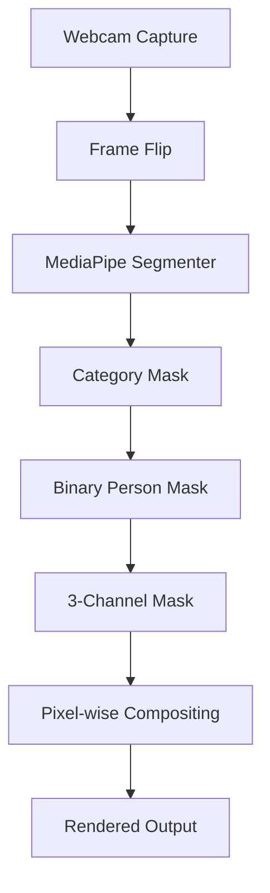

---
# 🎥 Virtual Background Replacement (Zoom-Style)
A **real-time, local-only** virtual background replacement system built with **Python**, **OpenCV**, and **MediaPipe Image Segmentation**.

> **Project Scope:**
>
> * Uses **live webcam feed**
> * Performs **real-time human segmentation**
> * Replaces background with **static images or solid color**
> * Supports **keyboard-based background switching**
> * **No recording, no streaming, no cloud processing**

---

> [!CAUTION]
>
> ### 🛑 STRICTLY LOCAL EXECUTION
>
> **Architectural & Privacy Disclaimer**
>
> This application is engineered for **Offline / Local Use Only**.
>
> * **No Server-Side Processing:** All frames are processed on the user's machine.
> * **No Streaming:** Webcam data never leaves the local system.
> * **No Storage:** No video or image data is saved unless explicitly added as a background.
>
> Users are fully responsible for how they use this software in accordance with privacy policies and local regulations.

---

## ✅ Design Intent

This project focuses on **core computer vision fundamentals** rather than UI polish or feature overload.

* 🧠 **ML-First Pipeline:** Emphasis on segmentation correctness and frame consistency.
* ⚡ **Real-Time Processing:** Designed for low-latency webcam inference.
* 🧩 **Minimal Dependencies:** Avoids heavyweight frameworks unless necessary.
* 🔁 **Deterministic Flow:** Explicit frame → mask → composite pipeline.
* 🖥️ **Local & Transparent:** Easy to debug and extend for learning purposes.

---

## 📦 Tech Stack

| Category       | Tool                           | Purpose                                      |
| :------------- | :----------------------------- | :------------------------------------------- |
| **Language**   | **Python 3.10+**               | Rapid prototyping & CV ecosystem support     |
| **Vision**     | **OpenCV**                     | Camera I/O, resizing, display, image ops     |
| **ML Runtime** | **MediaPipe Tasks API**        | Real-time image segmentation                 |
| **Model**      | **Selfie Segmenter (.tflite)** | Pixel-level person/background classification |
| **Math**       | **NumPy**                      | Fast, vectorized pixel blending              |

---

## 📁 Project Structure

```text
VirtualBG/
├── Model/
│   └── selfie_segmenter.tflite   # MediaPipe segmentation model
│
├── backgrounds/
│   ├── bg1.jpg
│   ├── bg2.png                   # Any Background
│
├── main.py                       # Full segmentation + compositing pipeline
├── test.py
│
└── README.md
```

---

## 🔁 Architecture & Flow

The system follows a **strict frame-based CV pipeline**, similar to production video conferencing software.



**Key Separation:**

* ML inference is isolated to segmentation
* Background logic is independent of model inference
* Rendering is fully deterministic

---

## 🧠 Core Logic Explained

### 1️⃣ Segmentation

MediaPipe produces a **category mask** where:

* `0` → background
* `> 0` → person

This mask is converted into a binary **person mask**.

### 2️⃣ Mask Expansion

The binary mask is expanded into **3 channels** to match the RGB frame shape.

### 3️⃣ Background Replacement

A vectorized NumPy operation replaces pixels:

```
if person → background pixel
else → original frame pixel
```

This avoids loops and ensures real-time performance.

### 4️⃣ Background Switching

Press **`D`** to cycle through available background images using modulo indexing.

---

## ⌨️ Controls

| Key | Action            |
| :-- | :---------------- |
| `D` | Switch background |
| `Q` | Quit application  |

---

## 📊 Performance Notes

* Runs in **VIDEO mode** for temporal stability
* Timestamped inference prevents frame desync
* Typical performance:

  * **20–35 FPS** on CPU (system dependent)
* Minor edge artifacts may occur around:

  * Hair
  * Fast motion
  * Fingers

These are expected for **binary segmentation without refinement**.

---

## ⚠️ Known Limitations

* Hard mask (no feathering)
* No temporal smoothing
* CPU-only inference
* No alpha blending

These are **intentional omissions** to keep the pipeline inspectable and educational.

---

## 🧭 Roadmap

### ✅ Current MVP (Implemented)

* [x] Live webcam segmentation
* [x] Background image replacement
* [x] Solid color fallback
* [x] Keyboard-based switching
* [x] Side-by-side debug view

### 🔮 Planned Enhancements

* [ ] Mask feathering / edge blur
* [ ] Smoothing
* [ ] GPU delegate support
* [ ] Making a .exe for personal use
* [ ] Streamlit / FastAPI wrapper
* [ ] Snapchat replica

---

## 📌 Why This Project Matters

This project demonstrates:

* Real-time ML inference
* Pixel-level image compositing
* Practical MediaPipe usage
* Production-style CV pipeline design

It mirrors the **core mechanics behind Zoom / Google Meet virtual backgrounds**, stripped down to essentials for learning and experimentation.

---
# Thank You!
