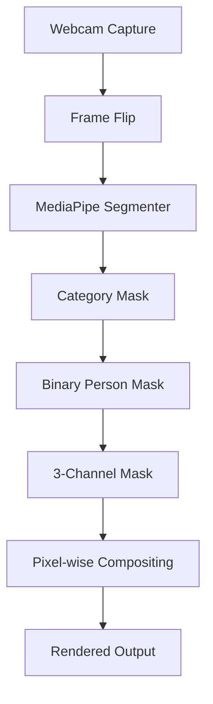

# 🎥 Virtual Background Replacement (Zoom-Style)
A **real-time, local-only** virtual background replacement system built with **Python**, **OpenCV**, and **MediaPipe Image Segmentation**.

> **Project Scope:**
>
> * Uses **live webcam feed**
> * Performs **real-time human segmentation**
> * Replaces background with **static images or solid color**
> * Supports **keyboard-based background switching**
> * **No recording, no streaming, no cloud processing**

---

> [!CAUTION]
>
> ### 🛑 STRICTLY LOCAL EXECUTION
>
> **Architectural & Privacy Disclaimer**
>
> This application is engineered for **Offline / Local Use Only**.
>
> * **No Server-Side Processing:** All frames are processed on the user's machine.
> * **No Streaming:** Webcam data never leaves the local system.
> * **No Storage:** No video or image data is saved unless explicitly added as a background.
>
> Users are fully responsible for how they use this software in accordance with privacy policies and local regulations.

---

## ✅ Design Intent

This project focuses on **core computer vision fundamentals** rather than UI polish or feature overload.

* 🧠 **ML-First Pipeline:** Emphasis on segmentation correctness and frame consistency.
* ⚡ **Real-Time Processing:** Designed for low-latency webcam inference.
* 🧩 **Minimal Dependencies:** Avoids heavyweight frameworks unless necessary.
* 🔁 **Deterministic Flow:** Explicit frame → mask → composite pipeline.
* 🖥️ **Local & Transparent:** Easy to debug and extend for learning purposes.

---

## 📦 Tech Stack

| Category       | Tool                           | Purpose                                      |
| :------------- | :----------------------------- | :------------------------------------------- |
| **Language**   | **Python 3.10+**               | Rapid prototyping & CV ecosystem support     |
| **Vision**     | **OpenCV**                     | Camera I/O, resizing, display, image ops     |
| **ML Runtime** | **MediaPipe Tasks API**        | Real-time image segmentation                 |
| **Model**      | **Selfie Segmenter (.tflite)** | Pixel-level person/background classification |
| **Math**       | **NumPy**                      | Fast, vectorized pixel blending              |

---

## 📁 Project Structure

```text
VirtualBG/
├── Model/
│   └── selfie_segmenter.tflite   # MediaPipe segmentation model
│
├── backgrounds/
│   ├── bg1.jpg
│   ├── bg2.png                   # Any Background
│
├── final.py                    # Full segmentation + compositing pipeline
│
└── README.md
```

---

## 🔁 Architecture & Flow

The system follows a **strict frame-based CV pipeline**, similar to production video conferencing software.



**Key Separation:**

* ML inference is isolated to segmentation
* Background logic is independent of model inference
* Rendering is fully deterministic

---

## 🧠 Core Logic/Syntax Explained
# Big Picture First (very important)
This program does **only 4 things**, in a loop:

1. 📸 Take a photo from your webcam
2. 🧠 Ask MediaPipe: *“Which pixels belong to a person?”*
3. 🎭 Replace all **person pixels** with a background image
4. 🖥️ Show the result on screen
---

# Step 1: Imports (why each exists)

```python
import cv2          # Camera, windows, images
import mediapipe as mp  # Gives us the AI model
import numpy as np  # Fast math on images (pixels)
import os           # File/folder handling
import time         # FPS calculation
```

# Step 2: MediaPipe setup (this is NOT scary)

```python
mp_image_segmenter = mp.tasks.vision.ImageSegmenter
mp_base_options = mp.tasks.BaseOptions
mp_vision = mp.tasks.vision
```

Think of this as:

> “Give me the **segmentation tool** from MediaPipe”

No logic yet. Just importing the tool.

---

## Loading the AI model

```python
model_path = "./Model/selfie_segmenter.tflite"
base_options = mp_base_options(model_asset_path=model_path)
```

This line means:

> “Here is the **AI brain file** I want you to use”

Important truth:

* `.tflite` = already trained model
* You are **not training anything**
* You are only **using** it

---

## Telling MediaPipe how we will use it

```python
options = mp_vision.ImageSegmenterOptions(
    base_options=base_options,
    running_mode=mp.tasks.vision.RunningMode.VIDEO,
    output_category_mask=True
)
```

Read this in English:

* `VIDEO` → “I will give you frames continuously”
* `output_category_mask=True` →
  “For every pixel, tell me what it is”

This is the **most important flag**.

Without it → no mask → nothing works.

---

# Step 3: Background system (pure logic, no AI)

```python
bg_folder = "./backgrounds"
bg_images_list = []
```

You are saying:

> “I will store all background image paths here”

---

### Load background images

```python
bg_images_list = [
    os.path.join(bg_folder, f)
    for f in files
    if f.lower().endswith(('.png', '.jpg', '.jpeg'))
]
```

Meaning:

* Look inside `backgrounds/`
* Take only image files
* Save their **paths**, not images yet

Why paths?
→ Saves memory
→ Faster startup

---

### Fallback logic (important)

```python
use_solid = len(bg_images_list) == 0
```

If no images exist:

* Use a **green screen**
* App still works

That’s good engineering.

---

## Background loader function

```python
def load_background(index, width, height):
```

This function guarantees:

> “Whatever background I return will **match camera size**”

If you don’t do this → NumPy crashes later.

---

# Step 4: Camera setup

```python
cap = cv2.VideoCapture(0)
cap.set(3, 640)
cap.set(4, 480)
```

* `0` → default webcam
* Fixed resolution → stable FPS

---

# Step 5: The main loop (this is everything)

```python
with mp_image_segmenter.create_from_options(options) as segmenter:
    while True:
```

This means:

> “Load the AI model **once**, then reuse it every frame”

Very important for performance.

---

## Get a frame

```python
ret, frame = cap.read()
frame = cv2.flip(frame, 1)
```

* `frame` = image (numpy array)
* `flip(1)` = mirror (like Zoom)

---

## Convert frame for MediaPipe

```python
mp_image = mp.Image(image_format=mp.ImageFormat.SRGB, data=frame)
```

MediaPipe **cannot** directly use OpenCV images.

This line just **wraps** the image.

---

## Timestamp (this is not optional)

```python
timestamp_ms = int(cv2.getTickCount() * 1000 / cv2.getTickFrequency())
```

Why?

* VIDEO mode **needs time order**
* Helps MediaPipe stay stable

If timestamps go backward → segmentation breaks.

---

## Run the AI

```python
result = segmenter.segment_for_video(mp_image, timestamp_ms)
```

This is the **only AI call** in your whole code.

Everything else is normal Python.

---

# Step 6: Understanding the mask (CRUCIAL)

```python
category_mask = result.category_mask.numpy_view()
```

This gives a **2D array** like:

```
0 0 0 0
0 1 1 0
0 1 1 0
0 0 0 0
```

* `0` → background
* `1` (or >0) → person

Each number = **one pixel**

---

## Convert to binary mask

```python
person_mask = (category_mask > 0).astype(np.uint8)
```

Now:

* Background = `0`
* Person = `1`

This is what we want.

---

## Convert mask to 3 channels

```python
mask_3ch = cv2.merge([person_mask, person_mask, person_mask])
```

Why?

* Frame shape = `(H, W, 3)`
* Mask must match shape for replacement

---

# Step 7: Background replacement (the magic line)

```python
output = np.where(mask_3ch, current_bg, frame)
```

Read it slowly:

> If mask pixel = 1 → take background
> Else → take original frame

That’s it.
No AI here. Just math.

---

# Step 8: FPS and display

```python
fps = 1 / (cTime - pTime)
```

Simple timing math.

```python
out = np.hstack((frame, output))
```

Left = original
Right = replaced background

Good for debugging.

---

# Step 9: Keyboard logic

```python
elif key == ord('d'):
    current_bg_index = (current_bg_index + 1) % len(bg_images_list)
```

Modulo `%` ensures:

* No index error
* Loops forever


### 4️⃣ Background Switching

Press **`D`** to cycle through available background images using modulo indexing.

---

## ⌨️ Controls

| Key | Action            |
| :-- | :---------------- |
| `D` | Switch background |
| `Q` | Quit application  |

---
## ⚠️ Known Limitations

* Hard mask (no feathering)
* No temporal smoothing
* CPU-only inference
* No alpha blending

These are **intentional omissions** to keep the pipeline inspectable and educational.

---

## 🧭 Roadmap

### ✅ Current MVP (Implemented)

* [x] Live webcam segmentation
* [x] Background image replacement
* [x] Solid color fallback
* [x] Keyboard-based switching
* [x] Side-by-side debug view

### 🔮 Planned Enhancements

* [ ] Mask feathering / edge blur
* [ ] Smoothing
* [ ] GPU delegate support
* [ ] Making a .exe for personal use
* [ ] Streamlit / FastAPI wrapper
* [ ] Snapchat replica

---

## 📌 Why This Project Matters

This project demonstrates:

* Real-time ML inference
* Pixel-level image compositing
* Practical MediaPipe usage
* Production-style CV pipeline design
---

# Thank You!
